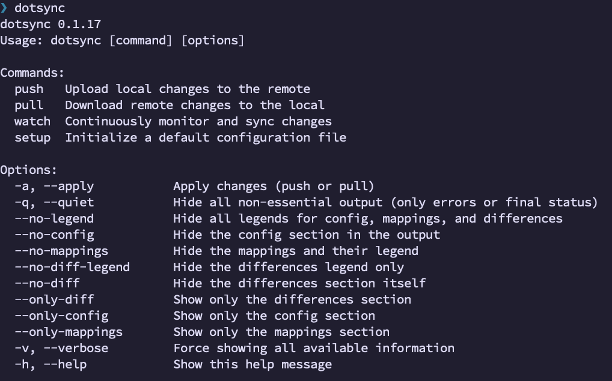
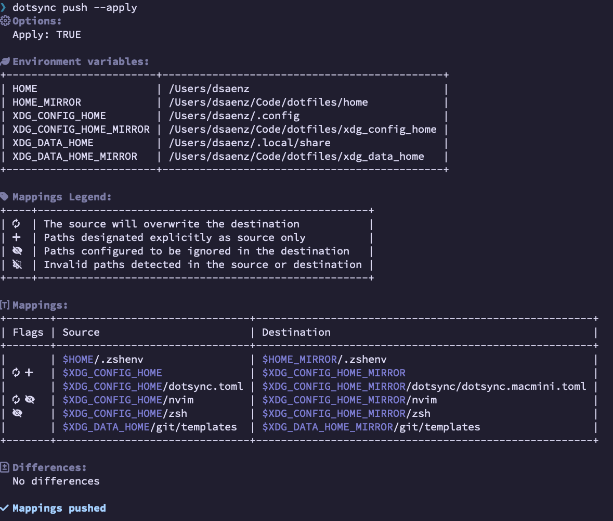
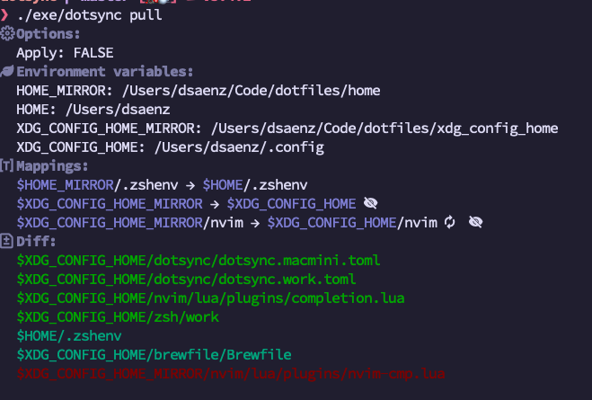

# Dotsync

[](https://rubygems.org/gems/dotsync)
[](https://github.com/dsaenztagarro/dotsync/actions)

> [!WARNING]
> This gem is under active development. You can expect new changes that may not be backward-compatible.

Welcome to Dotsync! This gem helps you manage and synchronize your dotfiles effortlessly. Below you'll find information on installation, usage, and some tips for getting started.

  

## Requirements
- Ruby: MRI 3.2+

## Installation

Add this line to your application's Gemfile:

```ruby
gem "dotsync"
```

And then execute:

    $ bundle install

Or install it yourself as:

    $ gem install dotsync

## Usage

### Executable Commands

Dotsync provides the following commands to manage your dotfiles:

- **Push**: Transfer dotfiles from your local machine to the destination repository.
  ```shell
  dotsync push --apply [OPTION]
  ```
  Options:
    - `-q, --quiet`: Hide all non-essential output (only errors or final status).
    - `--no-legend`: Hide all legends for config, mappings, and differences.
    - `--no-config`: Hide the config section in the output.
    - `--no-mappings`: Hide the mappings and their legend.
    - `--no-diff-legend`: Hide the differences legend only.
    - `--no-diff`: Hide the differences section itself.
    - `--only-diff`: Show only the differences section.
    - `--only-config`: Show only the config section.
    - `--only-mappings`: Show only the mappings section.
    - `-v, --verbose`: Force showing all available information.

  

- **Pull**: Synchronize dotfiles from the repository to your local machine.
  ```shell
  dotsync pull --apply [OPTION]
  ```
  Options:
    - `-q, --quiet`: Hide all non-essential output (only errors or final status).
    - `--no-legend`: Hide all legends for config, mappings, and differences.
    - `--no-config`: Hide the config section in the output.
    - `--no-mappings`: Hide the mappings and their legend.
    - `--no-diff-legend`: Hide the differences legend only.
    - `--no-diff`: Hide the differences section itself.
    - `--only-diff`: Show only the differences section.
    - `--only-config`: Show only the config section.
    - `--only-mappings`: Show only the mappings section.
    - `-v, --verbose`: Force showing all available information.

  During the `pull` operation, `Dotsync::PullAction` creates a backup of the existing files on the destination. These backups are stored in a directory under the XDG path, with each backup organized by a timestamp. To prevent excessive storage usage, only the 10 most recent backups are retained. Older backups are automatically purged, ensuring efficient storage management.

  

- **Watch**: Continuously monitor and sync changes between your local machine and the repository.
  ```shell
  dotsync watch
  ```

- **Setup**: Generate a default configuration file at `~/.config/dotsync.toml` with example mappings for `pull`, `push`, and `watch`.
  ```shell
  dotsync setup
  ```

### Configuration

The configuration file uses a `mappings` structure to define the source and destination of your dotfiles. Here is an example:

```toml
[[pull.mappings]]
src = "$XDG_CONFIG_HOME_MIRROR"
dest = "$XDG_CONFIG_HOME"
ignore = ["nvim"]

[[pull.mappings]]
src  = "$XDG_CONFIG_HOME_MIRROR/nvim"
dest = "$XDG_CONFIG_HOME/nvim"
# FEATURE: forces the deletion of destination folder
force = true
# FEATURE: use relative paths to "dest" to ignore files and folders
ignore = ["lazy-lock.json"]

[[pull.mappings]]
src = "$HOME_MIRROR/.zshenv"
dest = "$HOME"


[[push.mappings]]
src = "$HOME/.zshenv"
src = "$HOME_MIRROR/.zshenv"

[[push.mappings]]
src = "$XDG_CONFIG_HOME/alacritty"
dest = "$DOTFILES_DIR/config/alacritty"
# FEATURE: transfer only relative paths of files and folders passed here
only = ["alacritty.toml", "rose-pine.toml"]


[[watch.mappings]]
src = "$HOME/.zshenv"
src = "$HOME_MIRROR/.zshenv"

[[watch.mappings]]
src = "$XDG_CONFIG_HOME/alacritty"
dest = "$DOTFILES_DIR/config/alacritty"
```

> [!TIP]
> I use mirror environment variables to cleaner configuration
>
>  ```bash
>  export XDG_CONFIG_HOME_MIRROR="$HOME/Code/dotfiles/xdg_config_home"
>  ```

#### `force` and `ignore` Options in Mappings

Each mapping entry supports the following options:

- **`force`**: A boolean (true/false) value. When set to `true`, it forces deletion of the destination folder before transferring files from the source. This is particularly useful when you need to ensure that the destination is clean before a transfer.
- **`only`**: An array of files or folders. This option ensures that only the specified files or folders from the `src` directory are transferred to the `dest` directory. Example:
  ```toml
  [[push.mappings]]
  src = "$XDG_CONFIG_HOME"
  dest = "$DOTFILES_DIR/config"
  only = ["config.yml", "themes"]

  ```
- **`ignore`**: An array of patterns or file names to exclude during the transfer. This allows you to specify files or folders that should not be copied from the source to the destination.

These options apply when the source is a directory and are relevant for both `push` and `pull` operations.

### Customizing Icons

Dotsync allows you to customize the icons displayed in the console output by adding an `[icons]` section to your configuration file (`~/.config/dotsync.toml`). This is useful if you prefer different icons or need compatibility with terminals that don't support Nerd Fonts.

#### Available Icon Options

You can customize the following icons in your configuration:

**Mapping Status Icons** (shown next to each mapping):
- `force` - Indicates force deletion is enabled (clears destination before transfer)
- `only` - Indicates only specific files will be transferred
- `ignore` - Indicates files are being ignored during transfer
- `invalid` - Indicates the mapping is invalid (missing source/destination)

**Difference Status Icons** (shown in diff output):
- `diff_created` - Shows newly created/added files
- `diff_updated` - Shows updated/modified files
- `diff_removed` - Shows removed/deleted files

#### Example Configuration

Here's a complete example showing all customizable icons using UTF-8 emojis (works without Nerd Fonts):

```toml
[icons]
# Mapping status icons
force = "⚡"           # Force deletion enabled
only = "📋"            # Only specific files transferred
ignore = "🚫"          # Files ignored during transfer
invalid = "❌"         # Invalid mapping

# Diff status icons
diff_created = "✨"    # New files created
diff_updated = "📝"    # Files modified
diff_removed = "🗑️ "    # Files deleted

# Example mappings section
[[pull.mappings]]
src = "$XDG_CONFIG_HOME_MIRROR"
dest = "$XDG_CONFIG_HOME"
ignore = ["cache"]
```

#### Default Icons

If you don't specify custom icons, Dotsync uses [Nerd Font](https://www.nerdfonts.com) icons by default. These icons will only display correctly if you're using a terminal with a patched Nerd Font installed.

| Icon | Default (Nerd Font) | Nerd Font Code | Purpose |
|------|---------------------|----------------|---------|
| `force` | `󰁪 ` | `nf-md-lightning_bolt` | Force deletion enabled |
| `only` | ` ` | `nf-md-filter` | Only mode active |
| `ignore` | `󰈉 ` | `nf-md-cancel` | Ignoring files |
| `invalid` | `󱏏 ` | `nf-md-alert_octagram` | Invalid mapping |
| `diff_created` | ` ` | `nf-md-plus` | File created |
| `diff_updated` | ` ` | `nf-md-pencil` | File updated |
| `diff_removed` | ` ` | `nf-md-minus` | File removed |

> [!NOTE]
> The icons in the "Default (Nerd Font)" column may not be visible unless you're viewing this with a Nerd Font. You can find these icons at [nerdfonts.com](https://www.nerdfonts.com/cheat-sheet) by searching for the Nerd Font Code.

> [!TIP]
> You can set any icon to an empty string (`""`) to hide it completely, or use any UTF-8 character or emoji. The `dotsync setup` command generates a configuration file with some example custom icons to get you started.

### Automatic Update Checks

Dotsync automatically checks for new versions once per day and notifies you if an update is available. This check is non-intrusive and will not interrupt your workflow.

To disable automatic update checks:
- Set environment variable: `export DOTSYNC_NO_UPDATE_CHECK=1`

The check runs after your command completes and uses a cached timestamp to avoid excessive API calls. The cache is stored in `~/.cache/dotsync/last_version_check` following the XDG Base Directory specification.

### Pro Tips

- **Using rbenv**: To ensure the gem uses the correct Ruby version managed by rbenv, you can run:
  ```shell
  RBENV_VERSION=3.2.0 dotsync push
  ```

- **Global Installation**: Install the gem using a globally available Ruby version to make the executable accessible anywhere:
  ```shell
  gem install dotsync
  ```

## Development

- After checking out the repo, run `bin/setup` to install dependencies.
- Then, run `rake spec` to run the tests.
- You can also run `bin/console` for an interactive prompt that will allow you to experiment.
- To install this gem onto your local machine, run `bundle exec rake install`.

### Releasing a new version
- Update the version number in `version.rb`.
- Run `bundle exec rake release`, which will create a git tag for the version, push git commits and tags, and push the `.gem` file to [rubygems.org](https://rubygems.org).

## Contributing

Bug reports and pull requests are welcome on GitHub at https://github.com/dsaenztagarro/dotsync. This project is intended to be a safe, welcoming space for collaboration, and contributors are expected to adhere to the [Contributor Covenant](http://contributor-covenant.org) code of conduct.

## License

The gem is available as open source under the terms of the [MIT License](https://opensource.org/licenses/MIT).

## Code of Conduct

Everyone interacting in the Dotsync project’s codebases, issue trackers, chat rooms and mailing lists is expected to follow the [code of conduct](https://github.com/dsaenztagarro/dotsync/blob/master/CODE_OF_CONDUCT.md).
